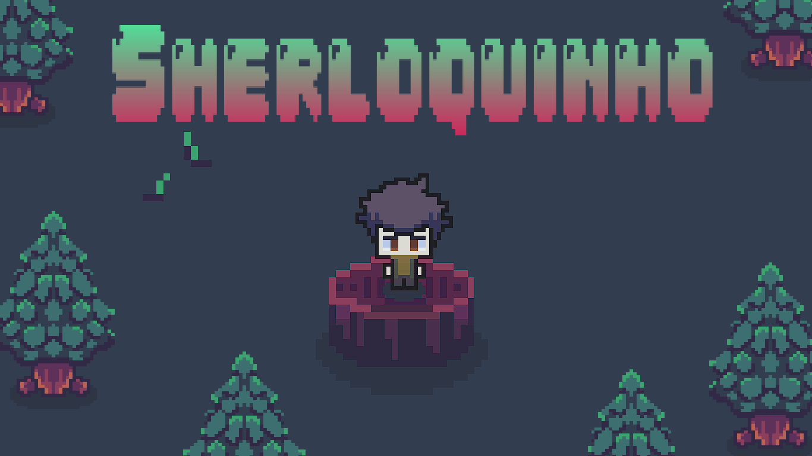
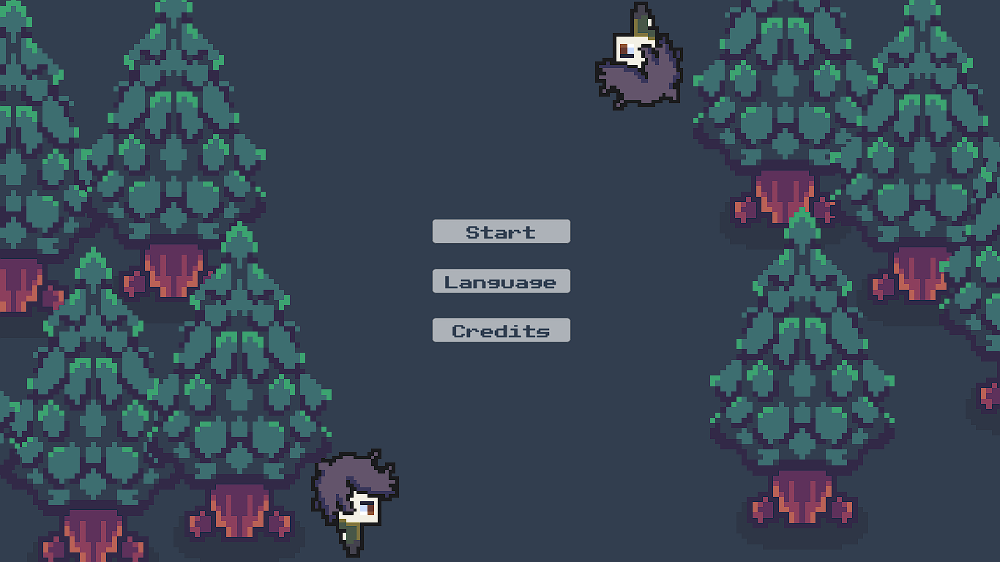
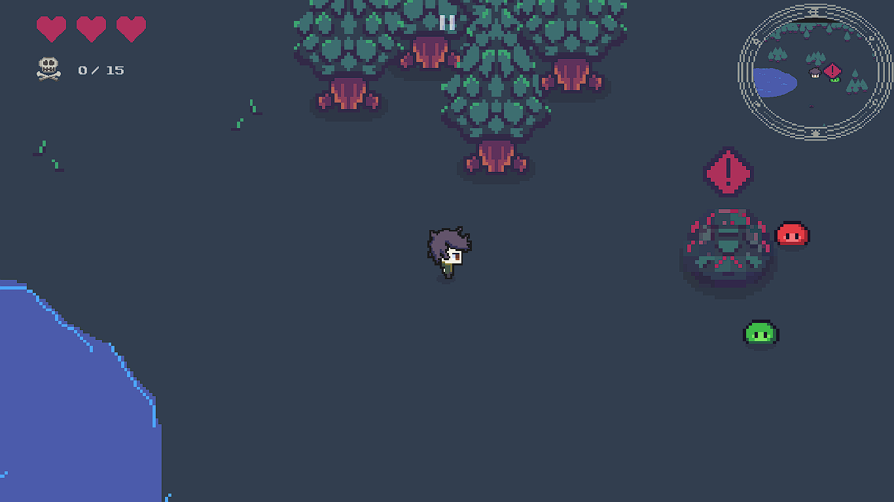
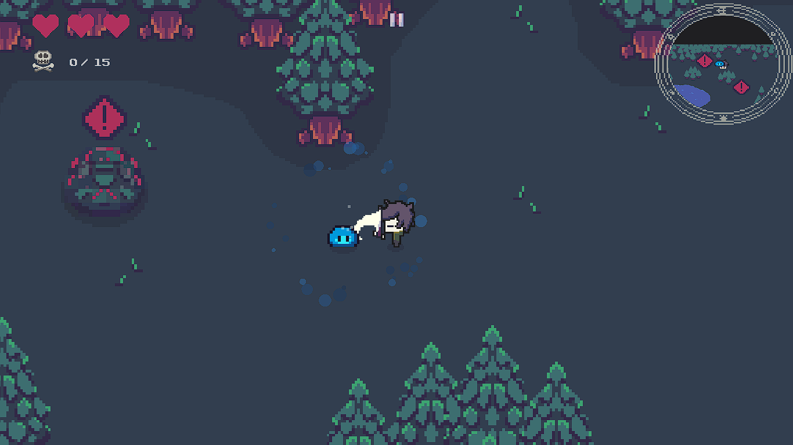
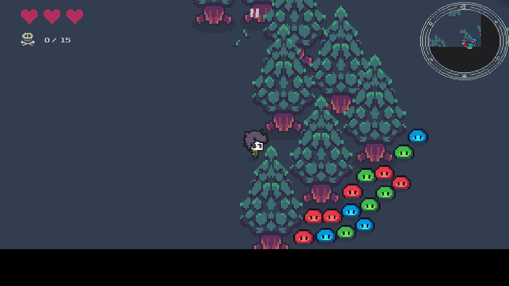
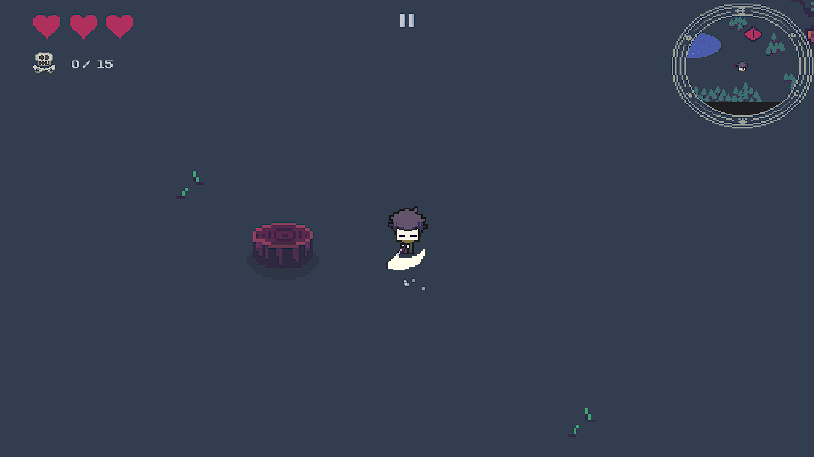
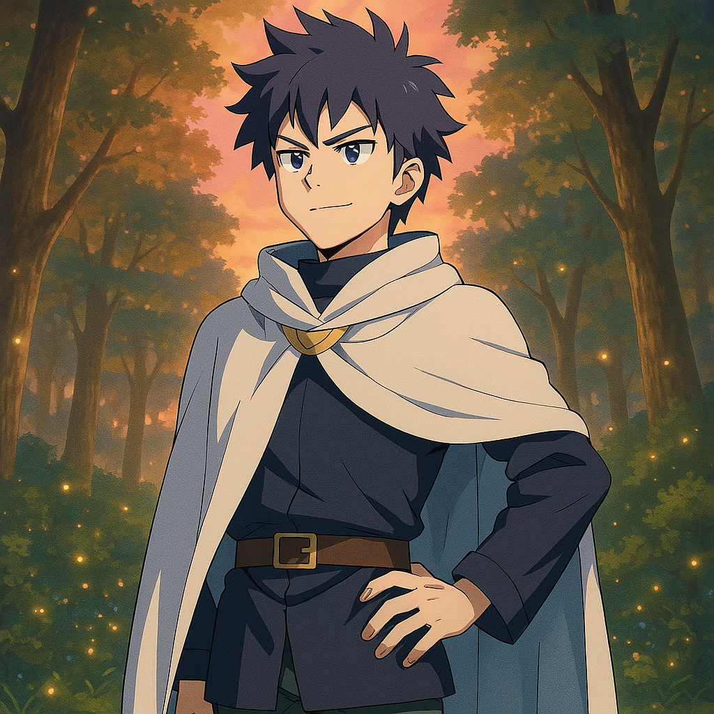
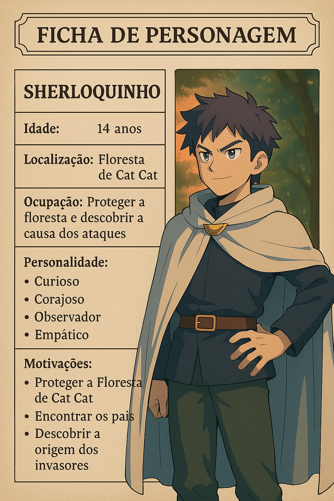

# 🕵️‍♂️ Sherloquinho V1

> *"Sempre há um rastro a seguir, basta saber onde procurar."*

Sherloquinho V1 é um jogo 2D top-down desenvolvido na Unity. Embarque em uma aventura na Floresta CatCat, enfrentando hordas de inimigos para restaurar a paz.

---

## 🎮 Descrição do Jogo

Você assume o papel de Sherloquinho, um jovem herói curioso e corajoso. Com mecânicas fluidas e controles simples, o jogo entrega ação intensa com um toque de estratégia.

---

## ⚙️ Características

- **Visual 2D Top-Down** clássico e envolvente  
- **Controles Intuitivos**:
  - Movimento: `W`, `A`, `S`, `D` ou setas direcionais  
  - Ataque: `K` para golpear inimigos  

- **Ação Intensa** em múltiplos cenários
- **Ambiente Imersivo**, com segredos e desafios

---

## 🕹️ Como Jogar

1. **Movimente-se** com `W`, `A`, `S`, `D` ou setas  
2. **Ataque** os inimigos com `K`  
3. **Objetivo**: proteger a floresta da invasão misteriosa  

---

## 🛠️ Instalação e Execução

### Pré-requisitos

- Unity 2D instalado  
- Git (opcional para clonar)

## Passos para Clonar e Executar o Projeto

1. Clonando o repositório:

git clone https://github.com/newtsarthur/SherloquinhoV1.git

2. Abrindo o projeto no Unity:

## Abra o Unity Hub.

Clique em Add e selecione a pasta onde o projeto foi clonado.

Aguarde o carregamento dos assets e, em seguida, clique em Play para testar o jogo.

### Contribuição

Contribuições são sempre bem-vindas! Se você deseja ajudar a melhorar o Sherloquinho V1:

Abra issues para relatar problemas ou sugerir melhorias.

Envie pull requests com correções ou novas funcionalidades.

### Contato

Para dúvidas, sugestões ou contribuições, entre em contato:

GitHub: newtsarthur

### Links Úteis

Demo/Projeto ([TinyURL](https://tinyurl.com/2dprfwlq))

---

### **Ficha de Personagem – Sherloquinho**

1. **Nome**: Sherloquinho  
2. **Idade**: 14 anos  
3. **Localização/Contexto**: Floresta de Cat Cat  
4. **Ocupação/Objetivo**: Proteger a floresta dos seres que a invadiram e descobrir a causa desses ataques

---
 
---
---

---

### **História / Background**  
- **Origem**: Sherloquinho nasceu e cresceu na pequena vila na orla da Floresta de Cat Cat. Desde cedo, demonstrou curiosidade incomum, sempre explorando cada canto, conversando com viajantes e colecionando histórias sobre criaturas místicas.  
- **Família**: Seus pais são guardiões da floresta há gerações, responsáveis por manter a harmonia entre humanos e criaturas mágicas. Essa responsabilidade inspirou Sherloquinho, que desde criança é treinado em técnicas de rastreamento e observação.  
- **Chamada à Aventura**: A tranquilidade da vila foi abalada quando criaturas desconhecidas começaram a invadir a floresta, causando destruição e medo. Com o desaparecimento de seus pais durante uma das patrulhas, Sherloquinho decide assumir o posto de protetor.  

---

### **Personalidade**  
- **Curioso**: Sempre busca novas pistas e soluções. Não se contenta com a primeira resposta que encontra.  
- **Corajoso**: Mesmo com 14 anos, não hesita em encarar o perigo para defender o que ama.  
- **Observador**: Atento a detalhes que a maioria das pessoas ignora; usa essa habilidade para descobrir pontos fracos dos inimigos e segredos da floresta.  
- **Persistente**: Não desiste facilmente, sobretudo quando se trata de proteger os amigos e cumprir seu dever.  
- **Empático**: Se preocupa com o bem-estar das criaturas nativas e tenta entender os motivos por trás dos ataques, em vez de apenas combatê-las.  

---

### **Motivações e Objetivos**  
- **Proteger a Floresta de Cat Cat**: Principal missão, herdada da tradição familiar.  
- **Encontrar os Pais**: Investigar o que aconteceu com eles e resgatá-los, se estiverem em perigo.  
- **Descobrir a Origem dos Invasores**: Entender o porquê das criaturas estarem invadindo e destruindo a floresta, possivelmente encontrando um grande mistério por trás dos ataques.  

---

### **Aparência e Trajes**  
- **Traços Físicos**:  
  - Cabelos escuros e curtos, ligeiramente bagunçados.  
  - Olhos atentos, expressão confiante.  
  - Porte físico ágil, mas ainda em fase de crescimento.  
- **Roupas**:  
  - Camisa de manga longa e calça de tons escuros, feitas de tecido resistente.  
  - Um manto ou capa leve, típica de exploradores da floresta, que também serve para camuflagem e proteção.  
  - Botas adequadas para terrenos irregulares, reforçadas nas solas.  
- **Acessórios**:  
  - Um pequeno colar que era de sua mãe, possivelmente com um pingente que guarda algum poder ou lembrança importante.  
  - Cinto com compartimentos para itens de investigação (lupa, frascos para amostras, bloquinho de anotações).  

---

### **Habilidades e Competências**  
- **Investigação e Raciocínio Lógico**: Excelente em analisar situações e deduzir a melhor forma de agir.  
- **Rastreamento**: Consegue seguir pistas deixadas pelas criaturas na floresta, interpretando pegadas, marcas em árvores e outros sinais.  
- **Sobrevivência**: Conhece bem as plantas, rios e animais da Floresta de Cat Cat, sabendo onde se abrigar e o que pode ou não comer.  
- **Combate Básico**: Foi treinado pelos pais em técnicas simples de defesa com bastão e arco, mas ainda está em desenvolvimento.  

---

### **Desafios Internos**  
- **Insegurança**: Apesar de corajoso, Sherloquinho às vezes sente o peso da responsabilidade e questiona se está à altura da missão.  
- **Pressão Familiar**: Carrega o legado de seus pais e teme desapontá-los.  
- **Equilíbrio Emocional**: Lidar com o desaparecimento dos pais e o medo de perder a floresta exige maturidade que ele ainda está construindo.  

---

### **Relacionamentos**  
- **Aliados**:  
  - Habitantes da vila e criaturas bondosas da floresta, que veem em Sherloquinho a esperança de restaurar a paz.  
  - Mentores ou anciões da vila que o apoiam com conselhos e itens mágicos.  
- **Antagonistas**:  
  - Criaturas invasoras, lideradas por uma entidade ou força desconhecida que ameaça todo o ecossistema da Floresta de Cat Cat.  
- **Neutros**:  
  - Alguns mercadores e exploradores que apenas atravessam a floresta, não se importando tanto com o conflito.  

---

### **Frases Marcantes**  
- *“Sempre há um rastro a seguir, basta saber onde procurar.”*  
- *“A Floresta de Cat Cat é minha casa, e eu vou protegê-la a qualquer custo.”*  
- *“Eu posso não saber tudo, mas vou descobrir o que for preciso para salvar quem eu amo.”*  

---

### **Resumo**  
Sherloquinho é um jovem de 14 anos que carrega a missão de proteger a Floresta de Cat Cat, lidando com a invasão de criaturas misteriosas. Inteligente, curioso e corajoso, ele usa suas habilidades de investigação e rastreamento para descobrir pistas que possam salvar não apenas a floresta, mas também seus pais desaparecidos. Apesar das inseguranças naturais de sua idade, sua determinação e empatia o tornam um herói em potencial, cuja jornada promete revelar segredos antigos e enfrentar grandes desafios.

---

Divirta-se e boa sorte na missão de salvar a Floresta CatCat!
